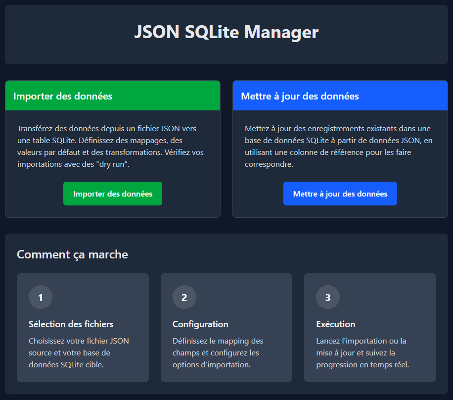

# JSON-SQLite Importer & Updater

Une application de bureau multi-plateforme pour importer et mettre à jour facilement des données JSON dans des bases de données SQLite.



## Fonctionnalités

### Importation JSON → SQLite

- **Navigation simplifiée** : Une interface guidée en 6 étapes pour importer vos données en toute simplicité
- **Exploration de structure** : Visualisez et sélectionnez automatiquement la structure de vos données JSON
- **Mapping intelligent** : Associez les champs JSON aux colonnes de votre base de données SQLite
- **Personnalisation avancée** :
  - Valeurs par défaut pour les données manquantes
  - Valeurs forcées pour remplacer systématiquement certains champs
  - Valeurs dynamiques avec support pour : `{{INDEX}}`, `{{UUID}}`, `{{TIMESTAMP}}`
- **Mode simulation** : Testez vos importations sans modifier la base de données
- **Suivi en temps réel** : Visualisez la progression et les logs d'importation

### Mise à jour SQLite depuis JSON

- **Processus guidé** : Une interface en 5 étapes pour mettre à jour des données existantes
- **Sélection précise** : Choisissez exactement quelles colonnes mettre à jour
- **Identification flexible** : Utilisez n'importe quelle colonne comme clé pour identifier les enregistrements
- **Mode simulation** : Vérifiez les mises à jour avant de les appliquer définitivement
- **Suivi détaillé** : Suivi de progression et logs détaillés

### Fonctionnalités générales

- **Interface intuitive** : Design moderne et épuré pour une utilisation facile
- **Mode sombre/clair** : Choisissez le thème qui vous convient
- **Multi-plateforme** : Fonctionne sur Windows, macOS et Linux
- **Haute performance** : Moteur Rust pour des opérations rapides, même avec de grands volumes de données
- **Autonome** : Application portable, aucune installation complexe requise

## Installation

### Téléchargements

Téléchargez la dernière version pour votre système d'exploitation :

- [Windows (exe/msi)](https://github.com/patricksardinha/JsonToSqlite/releases/latest)
- [macOS (dmg)](https://github.com/patricksardinha/JsonToSqlite/releases/latest)
- [Linux (AppImage/deb/rpm)](https://github.com/patricksardinha/JsonToSqlite/releases/latest)

### Instructions d'installation

#### Windows
Exécutez l'installeur `.nsis` ou `.msi` et suivez les instructions d'installation.

#### macOS
Installeur non supporté pour le moment.

#### Linux
Installeur non supporté pour le moment.

## Guide d'utilisation rapide

### Importation JSON vers SQLite

1. Sélectionnez vos fichiers source (JSON) et cible (SQLite)
2. Explorez la structure JSON et choisissez le chemin d'accès aux données
3. Sélectionnez la table SQLite de destination
4. Définissez les correspondances entre les champs JSON et les colonnes SQLite
5. Configurez les options avancées si nécessaire (valeurs par défaut, etc.)
6. Lancez l'importation et suivez la progression

### Mise à jour SQLite depuis JSON

1. Sélectionnez vos fichiers source (JSON) et la base de données à mettre à jour
2. Explorez la structure JSON et choisissez le chemin d'accès aux données
3. Sélectionnez la table à mettre à jour et la colonne clé
4. Choisissez les colonnes à mettre à jour
5. Lancez la mise à jour et suivez la progression

## Développement

Cette application est construite avec :
- [Tauri](https://tauri.app/) - Framework pour applications de bureau multi platforme
- [Rust](https://www.rust-lang.org/) - Backend haute performance
- [React](https://reactjs.org/) - Interface utilisateur réactive
- [Tailwind CSS](https://tailwindcss.com/) - Styles modernes et réactifs

### Prérequis pour le développement

- Node.js (v20+)
- Rust for Tauri > 2.0
- Outils de développement Tauri > 2.0 

### Installation pour le développement

```bash
# Cloner le dépôt
git clone https://github.com/patricksardinha/JsonToSqlite.git
cd JsonToSqlite

# Installer les dépendances
npm install

# Lancer en mode développement
npm run tauri dev
```

### Tests

```bash
# Exécuter les tests unitaires React
npm test

# Exécuter les tests Rust
cd src-tauri
cargo test
```

## Licence

Ce projet est distribué sous licence MIT. Voir le fichier [LICENSE](LICENSE) pour plus de détails.

## Contribution

Les contributions sont les bienvenues ! N'hésitez pas à ouvrir une issue ou à soumettre une pull request.

1. Forkez le projet
2. Créez votre branche (`git checkout -b feature/amazing-feature`)
3. Validez vos changements (`git commit -m 'Add some amazing feature'`)
4. Poussez vers la branche (`git push origin feature/amazing-feature`)
5. Ouvrez une Pull Request

## Contact

Pour toute question ou suggestion, n'hésitez pas à [ouvrir une issue](https://github.com/patricksardinha/JsonToSqlite/issues) sur GitHub.

---

A bientôt